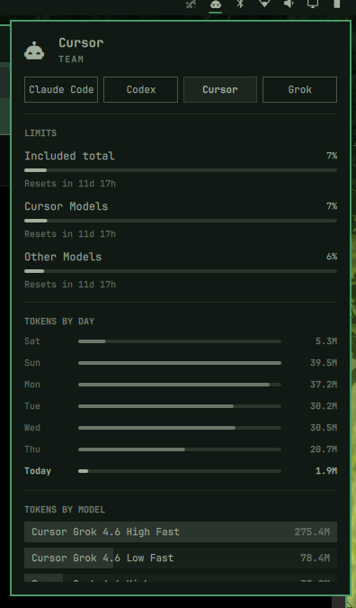

# Cursor Usage

Adds **Cursor** to Omarchy's **existing AI toolbar widget** — the AI icon already on the top bar. It does not add a second icon.

After install, click that same AI button. You get a **Cursor** chip next to **Claude Code** (and Codex / Grok / Fireworks if you use them): plan meters (Included / Cursor Models / Other Models) and token charts from Cursor's dashboard APIs.



## Install

```sh
omarchy plugin add https://github.com/mrlarsendk/omarchy-cursor-usage.git --enable
```

Requires:

- Omarchy with the stock AI widget enabled (`omarchy.agents`, on by default)
- Python 3 on `PATH` (stdlib only)
- Cursor IDE signed in, or Cursor Agent signed in (`cursor-agent login`)

Leave the built-in AI icon where it is. After the first scan, click it and switch to **Cursor**.

## Usage

- Left click the existing AI icon: usage panel
- Switch to **Cursor** with the chip in the panel (or middle-click the icon)
- `r` or Enter in the panel: refresh (Cursor follows the stock update)
- Cursor also refreshes about every 5 minutes

This plugin is a headless service. It only writes a Cursor usage record for the stock panel to display.

Plan meters come from Cursor's `GetCurrentPeriodUsage` / `GetPlanInfo` APIs. Day and model charts come from paged `GetFilteredUsageEvents`. Auth is read from the Cursor IDE `state.vscdb`, or from `~/.config/cursor/auth.json` after `cursor-agent login`.

## Remove

```sh
omarchy plugin remove io.github.mrlarsendk.cursor-usage
```

Removal deletes the plugin checkout and drops `~/.local/state/omarchy/agents/usage/cursor.json`, so the Cursor chip leaves the stock AI panel. It does not change Cursor login files or agent sessions.

## Privacy

The collector reads the local Cursor sign-in, then calls Cursor's dashboard usage endpoints. It never logs tokens. Expired tokens are not refreshed; open Cursor or run `cursor-agent login` to renew them.

## License

MIT. See [LICENSE](LICENSE).
